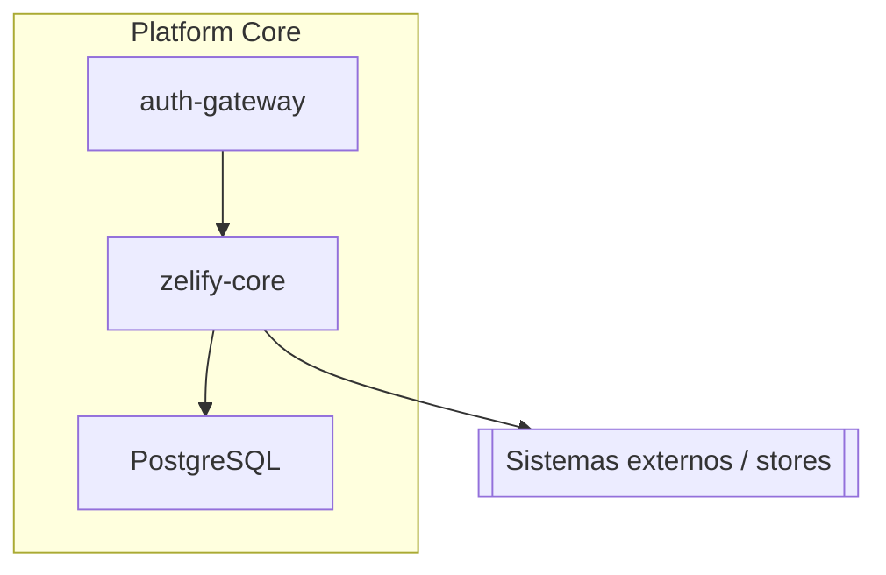
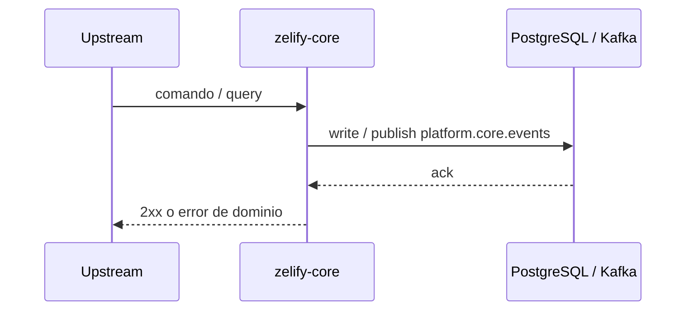

# Arquitectura — zelify-core

Vista de componente dentro de **Platform Core**.

## C4 (componente)

## Secuencia

El contexto de plataforma (personas, Pomelo, rieles, Kafka) está en `zelify-backstage` → Arquitectura.
