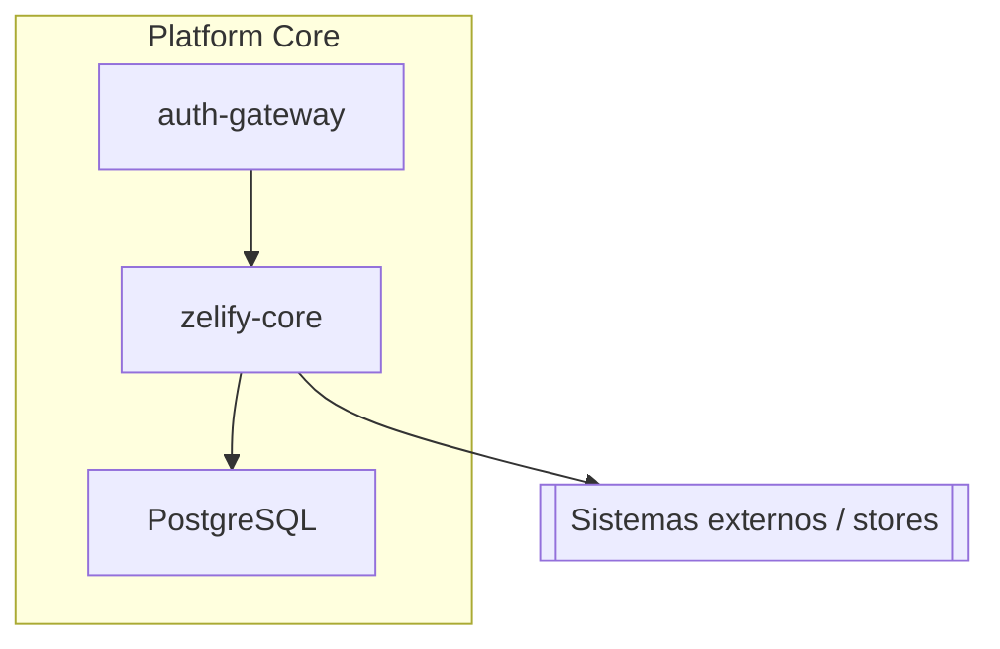
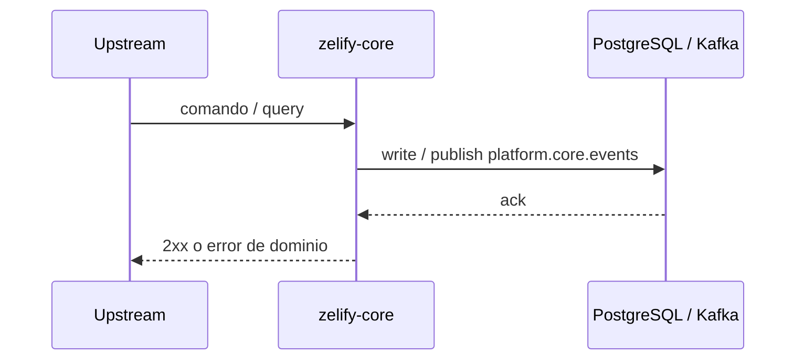
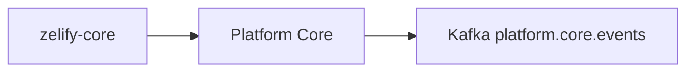

# zelify-core

> Zelify · sistema **Platform Core** (`platform-core`) · tipo `service` · owner `tech` · lifecycle `production` · typescript

Núcleo de la plataforma Zelify.

Repositorio: [zelify-dev/zelify-core](https://github.com/zelify-dev/zelify-core) · TechDocs en Backstage (esta misma carpeta `/docs`).

## Responsabilidades

| Hace | No hace |
| --- | --- |
| Cubrir el contrato de `service` dentro de **Platform Core** | Llamar rieles/Pomelo/Meta desde el cliente si hay un BFF |
| Publicar/consumir `platform.core.events` cuando el flujo es asíncrono | Guardar secretos en git o en este README |
| Exponer `/health` (servicios) y fallar cerrado | Inventar topics Kafka fuera de `docs/architecture/data-flows.md` |

Núcleo transaccional, catálogo de productos, jobs, storage y configuración global.

## Arquitectura

**Upstream:** auth-gateway, consumer-apps · **Downstream:** PostgreSQL, Kafka, S3 / storage

## Secuencia

## Contrato operativo

- **Owner:** `tech` (grupo Backstage).
- **Sistema:** `platform-core` — Platform Core.
- **Observabilidad:** logs estructurados, métricas de error rate, lag Kafka si consume.
- **Failure:** timeout + retry idempotente hacia externos; 4xx de dominio no se reintentan.
- **Config:** `.env` de desarrollo vive en el portal Envs; producción en vault / `dev-ops-configuration-files`.

## Cómo correrlo

1. Instala dependencias (`yarn` / `npm i` / Maven-Gradle según el lenguaje).
2. Copia el `.env.example` del equipo (nunca commitees secretos).
3. Levanta el proceso (`yarn start:dev`, `npm run start:dev` o `./gradlew bootRun`).
4. Health: `GET /health` (no `/` ni `/docs`).

## Relación con el resto de Zelify

El mapa C4 de la org está en TechDocs de `zelify-backstage` (context / containers / runtime).

## Docs adicionales del repo

- [guion-exposicion-scotiabank](guion-exposicion-scotiabank.md)

## Mantenimiento de esta doc

Este README y `/docs` se generan con formato senior (arquitectura + secuencia Mermaid) para el portal. Si el comportamiento real diverge, actualiza **este** Markdown y no dejes el README default de Nest/Create App.
